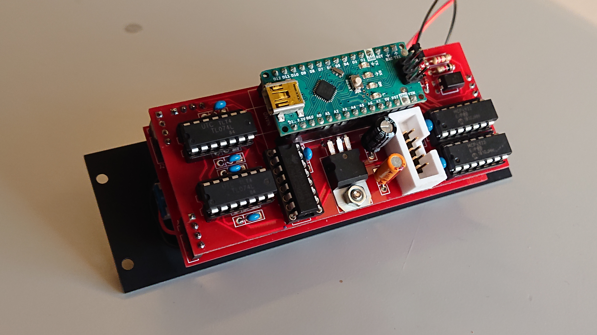
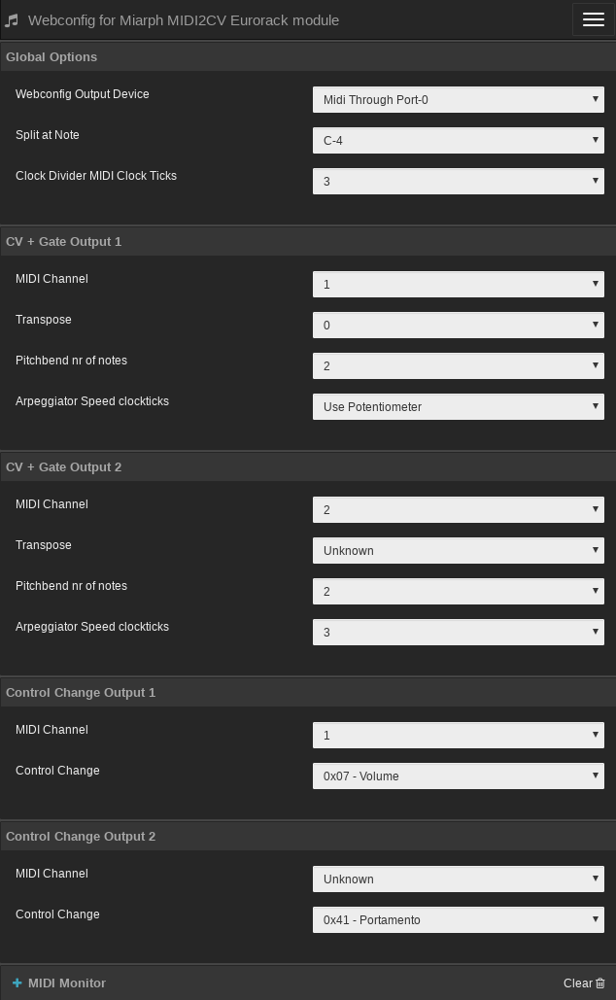

MIDI2CV + ARPEGGIATOR
=====================




[](http://www.youtube.com/watch?v=SEof3n9Ys9w)

[](http://www.youtube.com/watch?v=0akh9hcQQY0)

## Building Notes

* Use a real Arduino Nano or atleast one with a real FTDI chip.
* There is no tuning possibility, but a stable LM7805 is key.
* The LED is on the wrong side but easy fixable using 2 short wires. (This is the only mistake on the PCB).
* The LED resistor is dependent on your LED specs.
* Capacitors have three holes, always use the square one and one of the others. Both 2.54mm and 5.08mm caps will fit.
* Remove the jumper and power cable before programming!
* DO NOT CONNECT POWER AND USB AT THE SAME TIME!

## Programming Using Webconfig

See https://midi.tomarus.io/miarph/

You need a modern browser like Opera or Chrome to use this site.

Note that all values are initially *unknown* until you actually change something.
The device has no MIDI output so config values can't be read back.



## Programming Using the Commandline

Use the ```midi2cv``` Go utility to program the device.

Example:

```./midi2cv write 0x01 0x77```

Where ```0x01``` is the address and ```0x77``` the value.

List of addresses to program:

| Address | Description | Example value |
| -- | -- | -- |
| 0x00 | unused | -- |
| 0x01 | Split keyboard at note | 0x40 (use 0x00 for no split) |
| 0x02 | MIDI 1 Channel | 0x01 |
| 0x03 | MIDI 2 Channel | 0x02 |
| 0x04 | Transpose Channel 1 | 0x40 |
| 0x05 | Transpose Channel 2 | 0x40 |
| 0x06 | Control Change Number Channel 1 | 0x07 (0x07 = volume) |
| 0x07 | Control Change Number Channel 2 | 0x6A (0x6A = filter cutoff) |
| 0x08 | Control Change Channel 1 | 0x01 |
| 0x09 | Control Change Channel 2 | 0x02 |
| 0x0a | Pitchbend Channel 1 | 0x02 (number of notes) |
| 0x0b | Pitchbend Channel 2 | 0x0c (number of notes) |
| 0x0c | Midi Channel 1 sync | 0x00 (00 = use potmeter, otherwise nr of midi clock ticks) |
| 0x0d | Midi Channel 2 sync | 0x00 (00 = use potmeter, otherwise nr of midi clock ticks) |
| 0x0e | Clockticks to advance the clock divider | 0x03 (0x03 = sync to quarter notes) |
| 0x0f | unused | -- |
